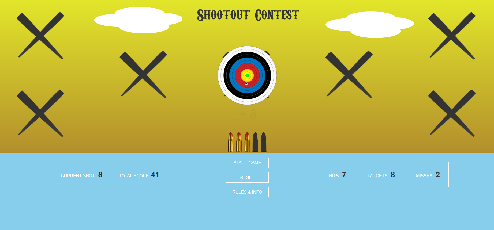

# Shootout Contest ('Whack-a-Mole')
 

 
Interesting project inspired by 'Whack a Mole' game !

# About the project

It is pretty obvious that inspiration for this project came from
       well known
       <a
         href="https://youtu.be/nANNPAlR2Z4?t=23"
         target="_blank"
         
         >'Whack a Mole'</a
       >
       original game. As I began developing, I decided to use as much as
       possible of my personal graphic resources, such as
       <a
         href="https://www.shutterstock.com/image-vector/archery-target-vector-illustration-1239642031"
         
         target="_blank"
         >target images</a
       >,
       <a
         href="https://www.shutterstock.com/image-vector/illustration-randomly-grouped-bullet-holes-pierced-1684976872"
         
         target="_blank"
         >bullet holes images</a
       >, bullets images, targets x-marks, <a
         href="https://www.shutterstock.com/image-illustration/set-fifteen-red-cross-hairs-bullet-138385712"
         
         target="_blank"
         >crosshair image </a
       >
       etc. Game sounds downloaded from <a href="https://freesound.org/" target="_blank"> here. <a/>
     
       Even though this game could be improved by adding
       extra functionality, such as levels, various choices and options for
       user...I rather kept it simple in order to save a valuable time,
       time I'd rather spend building another project and learning and
       practicing new JavaScript skills, as this one in my opinion
       fulfilled it's purpose.
  
  # Tech
  HTML, CSS, Vanilla JavaScript, SVG, Adobe Illustrator 
